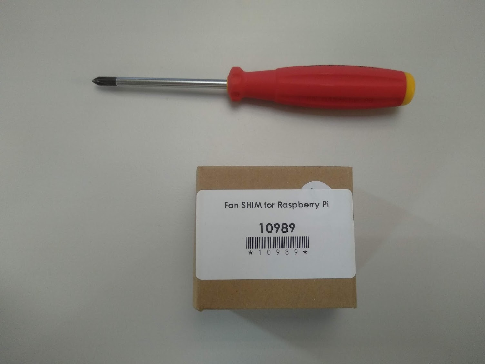

#HW zusammenbauen

### Ventilator zusammenbauen

https://learn.pimoroni.com/tutorial/sandyj/getting-started-with-fan-shim

* Eine Mutter bleibt übrig
* Ventilator noch nicht auf Raspi pappen
* Pi noch nicht ans Stromnetz anschliessen
* Stoppen beim Kapitel *Installing the Fan SHIM software*

### Raspi ins Case einfügen

https://www.youtube.com/watch?v=utk3cjzCLog

* Eine Mutter bleibt übrig
* Jedes Element hat eine Schutzfolie drauf, die entfernt werden soll

### SD Karte einführen

SD Karte mit Oberseite gegen unten in Raspi einführen.

Die SD Karten sind sind bereits mit einem Raspiblitz 1.3 geflasht.

### Festplatte in Gehäuse einbauen

Festplatte ins Gehäuse verbauen.

Gehäuse an einen der USB 3 Ports des Raspi hängen.

### Display anschliessen

Display anschliessen wie auf obigem Bild an Pins anschliessen.

Den Raspi mit 'Gummelis' auf der HD befestigen.

### Strom und Netz

Raspi per Ethernet an einem vorliegenden Switch anhängen.

DANACH den Raspi am Strom anschliessen.

Auf dem Display sollte nun ein blauer Screen mit der IP erscheinen:

# RaspiBlitz Installation

`ssh admin@[YOURIP]` → Passwort: `raspiblitz`

Danach weiter wie folgt:

https://github.com/rootzoll/raspiblitz#setup-process-detailed-documentation

----

Was noch fehlt:

* Gummelis
* Papier und Schreiber für Seed

